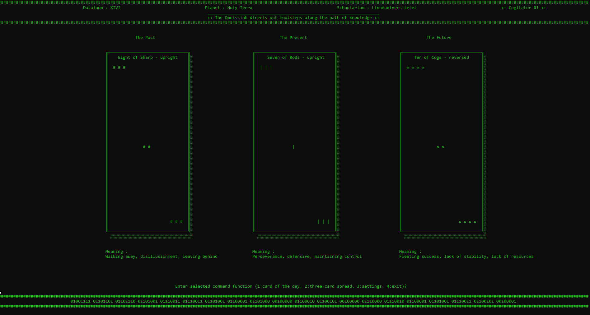

# the Omnissiah´s tarot

## a Training with using objects
As a practice with the use of objects in javascript I have written this terminal based tarotreader.

## Installation
- 1 Clone into a local folder using $ git clone
- 2 Run $ npm install

## Usage
Run in a maximized terminal window, such as cmd.com or powershell.
Run using $ npm start

Obs. for entertainment and educational purpose only! I take no resposibility for the predictions made.

## Authors and acknowledgment

- ॐ नमः शिवाय
- Sir Terry Pratchett, becuase Terry should always be acknowledged.
- Douglas Adams, becuase Douglas should always be acknowledged.
- The Omnissiah is from the 40k universe and are the ip of Games Workshop Limited.

## License
MIT

## Project status
Project is functional.

## Bugs and support
Please contact me throught discord, slack or student email. In that prefered order.
